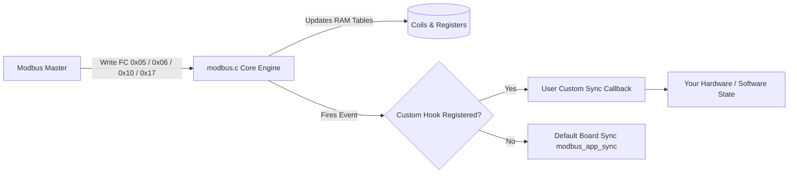

# Custom Register Mapping & Decoupled Hardware Synchronization

This directory provides a reference example demonstrating how to customize your Modbus register map (coils, discrete inputs, input registers, and holding registers) for any board or application without modifying the core `src/modbus.c` file.

## Key Features

1. **Zero-Fork Modbus Core**:
   Keep `src/modbus.c` completely clean and untouched across updates.
2. **Two Decoupling Mechanisms**:
   - **Runtime Registration (`modbus_register_sync_hooks`)**: Register callbacks with a user context pointer.
   - **Link-Time Weak Hooks (`modbus_app_sync_registers`)**: Define strong implementations in your application file to automatically override the default board I/O.
3. **Hardware Agnostic**:
   Works seamlessly on STM32F407, STM32F767, STM32H7, STM32G4, or any microcontroller.

## Architecture



## Quick Start Recipe

### Step 1: Include Headers and Define Application Map

```c
#include "modbus.h"
#include "custom_register_map_example.h"

static app_process_data_t g_process_data;
```

### Step 2: Initialize Core and Register Hooks

```c
void app_init(void)
{
    /* 1. Initialize Modbus RTU / TCP with your slave address */
    modbus_rtu_init(1);

    /* 2. Bind your custom register map */
    app_custom_register_map_init(&g_process_data);
}
```

### Step 3: Call Process Step in Main Loop or RTOS Task

```c
void loop(void)
{
    /* Handle serial reception */
    rs485_process();

    /* Process application data and update inputs */
    app_custom_process_step(&g_process_data);
}
```

## Comparison with Open-Source Alternatives

| Framework | Pattern | Portability | Thread Safety |
|---|---|---|---|
| **FreeMODBUS** | Per-FC Callbacks (`eMBRegHoldingCB`) | High | Manual mutex required |
| **libmodbus** | Flat `modbus_mapping_t` struct | High | Application polls struct |
| **stm32_automation_board** | **Pluggable Event Hooks + Weak Symbols** | **Highest (No core modifications)** | **Compatible with FreeRTOS & Bare-Metal** |
